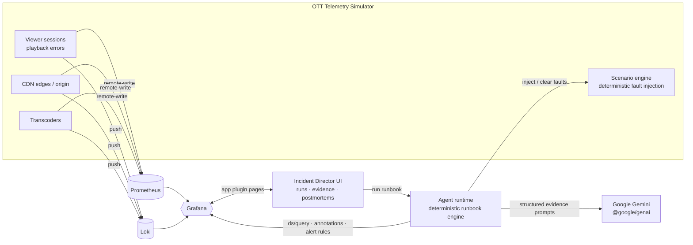

# Grafana Incident Director

[](LICENSE)
[](https://grafana.com)
[](https://ai.google.dev)
[](#roadmap)

> An autonomous incident-direction agent that lives **inside Grafana** and runs
> OTT/streaming incident response as a deterministic, five-step runbook:
> **Detect → Triangulate → Diagnose → Remediate → Report** — with every claim
> backed by an evidence chain of real Grafana queries and Loki log lines.

**Grafana now does incident direction.** Not a sidecar dashboard, not an external
poller — an app plugin where an agent (powered by Google Gemini) investigates
live streaming telemetry, narrows the blast radius, cites the exact PromQL and
log lines that prove the root cause, executes playbook remediations, writes the
story back into Grafana as annotations and panels, and publishes a postmortem
with a complete evidence chain.

---

## Why this shape wins

Streaming/OTT operators drown in telemetry: playback error rates, rebuffer
ratios, CDN edge latency, origin 5xx, transcoder backlog. The hard part is not
*seeing* the incident — it's *directing* it: which region, which device class,
which edge; is it CDN or origin; what's the playbook; when is it safe to stand
down. Today that work happens in a war room, in a Slack thread, in someone's
head at 3 a.m.

Grafana Incident Director turns that judgment into a **deterministic multi-step
runbook** executed by an agent that can read the same queries a human SRE would
run — through Grafana's own datasource API — and reason about them with Gemini.
Every run is replayable, every conclusion is cited, every action is logged.

## The runbook

| Step | What the agent does | Where it happens |
|------|--------------------|------------------|
| 1. **Detect** | Watches alert rules & threshold queries on playback error rate, rebuffer ratio, CDN edge latency, origin 5xx, transcoder backlog | Grafana alert rules + datasource API |
| 2. **Triangulate** | Narrows blast radius — region, device, edge vs fleet-wide — with targeted comparison queries | Grafana datasource API (PromQL) |
| 3. **Diagnose** | Correlates metrics + Loki logs, classifies root cause, **cites exact queries and log lines as evidence** | Gemini over Grafana-sourced evidence |
| 4. **Remediate** | Executes playbook actions (drain edge, failover origin, throttle ingest, roll back transcoder config) and logs each as a Grafana annotation + dashboard panel | Grafana annotations API |
| 5. **Report** | Publishes a postmortem in-plugin with the full evidence chain linked to each run | App plugin UI |

## Architecture



- **`plugin/`** — Grafana app plugin (frontend): the Incident Director lives as a page inside Grafana. Light theme, mobile-responsive, SVG iconography.
- **`agent/`** — the deterministic runbook engine. Each step is a typed stage with explicit inputs/outputs; Gemini is called with **structured evidence bundles** (never vibes), behind a swappable model-provider layer (Gemini API today, **Vertex AI at submission** — see `agent/src/models/`).
- **`sim/`** — Netflix-scale-believable OTT telemetry simulator (viewer sessions, playback errors, CDN edges, origin, transcoders) pushing to Prometheus remote-write + Loki, with a scenario engine for deterministic fault injection (the demo's "inject synthetic playback failures" lever).
- **`deploy/`** — run-anywhere configs: Windows binaries today, `docker-compose.yml` for the hosted demo.

Grafana is called at **runtime, in real code** — datasource queries, annotations,
alert rules all go through Grafana's HTTP API from the agent and plugin. That's
the product: the agent is a Grafana power-user, not an API poller.

## Quickstart (Windows, no Docker)

```powershell
git clone git@github.com:ubongn/grafana-incident-director.git
cd grafana-incident-director

# 1. Download Grafana / Prometheus / Loki binaries (one-time, ~5 min)
powershell -ExecutionPolicy Bypass -File deploy\setup-windows.ps1

# 2. Start the stack (Grafana :3000, Prometheus :9090, Loki :3100)
deploy\start-stack.cmd

# 3. Start the OTT telemetry simulator
cd sim && npm install && npm start

# 4. Open Grafana → dashboards "OTT Streaming Operations"
```

A Linux/docker-compose path ships with the hosted-demo milestone.

## Roadmap

- [x] **M1** — repo bootstrapped; local Grafana + Prometheus + Loki (Windows binaries); OTT telemetry simulator emitting; dashboards rendering live sim data
- [ ] **M2** — Grafana app plugin scaffold + Incident Director UI shell; agent runtime with runbook engine; Gemini model-provider layer
- [ ] **M3** — full Detect → Triangulate → Diagnose → Remediate → Report loop against live sim; annotations + postmortem rendering
- [ ] **M4** — fault-injection demo flow, hosted demo URL, video walkthrough, submission package

## Suggested repository topics

`grafana` `grafana-plugin` `incident-response` `sre` `observability` `gemini`
`google-cloud` `llm-agents` `ai-agents` `ott` `video-streaming` `prometheus` `loki`

## License

[MIT](LICENSE) © 2026 ubongn
